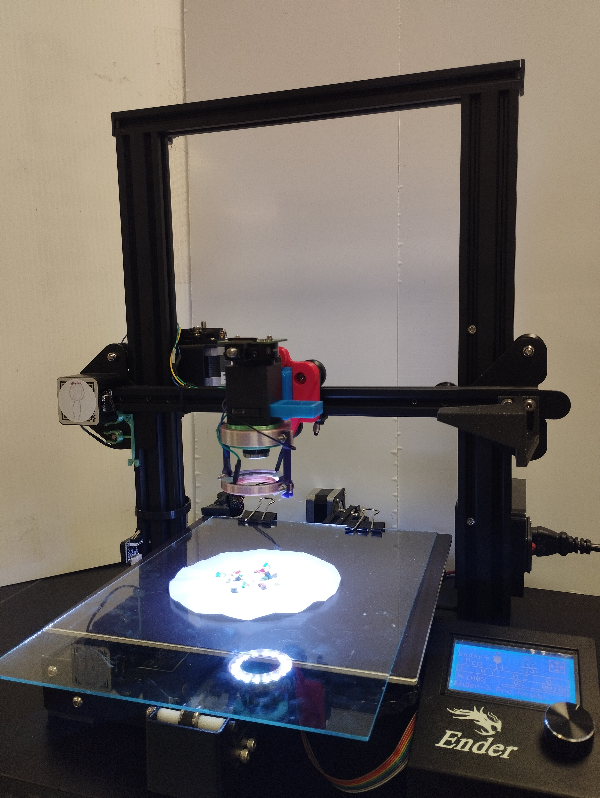
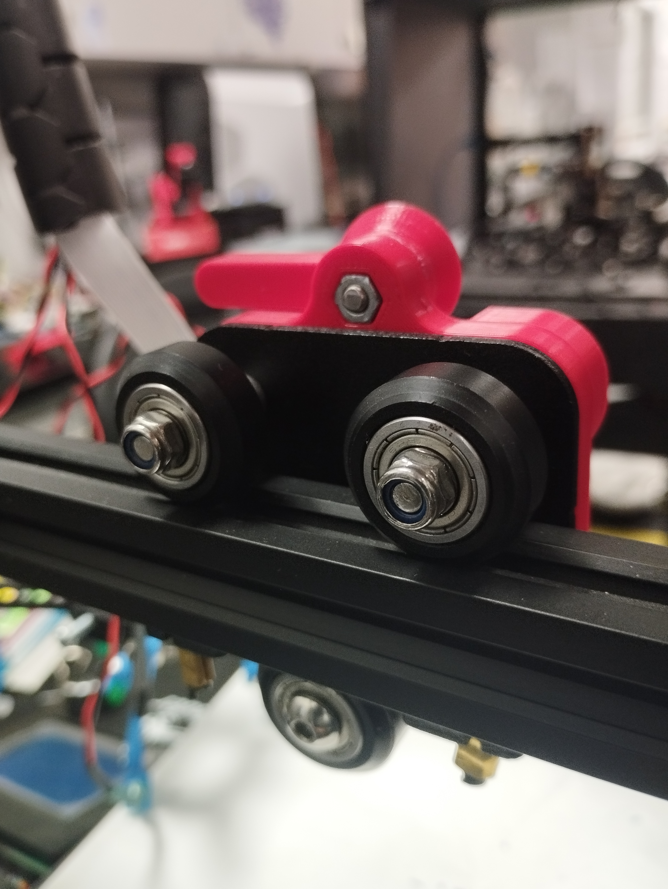
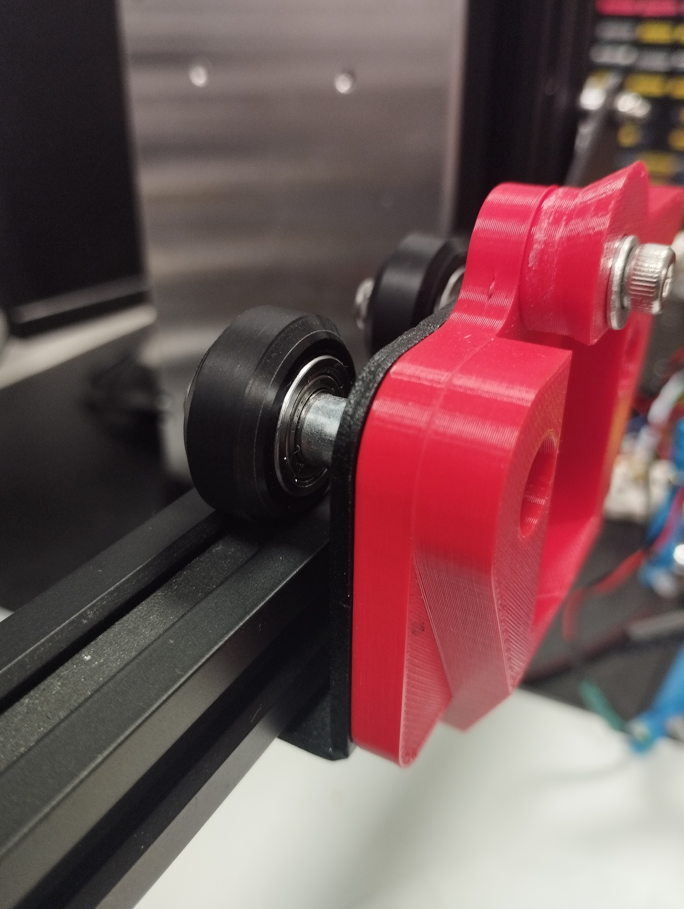
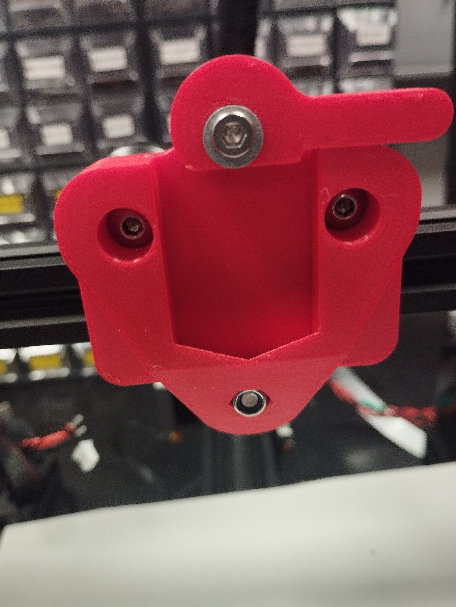
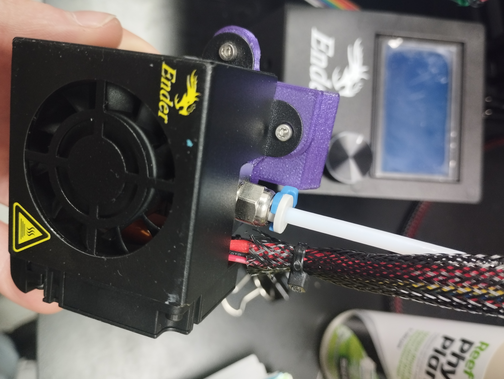
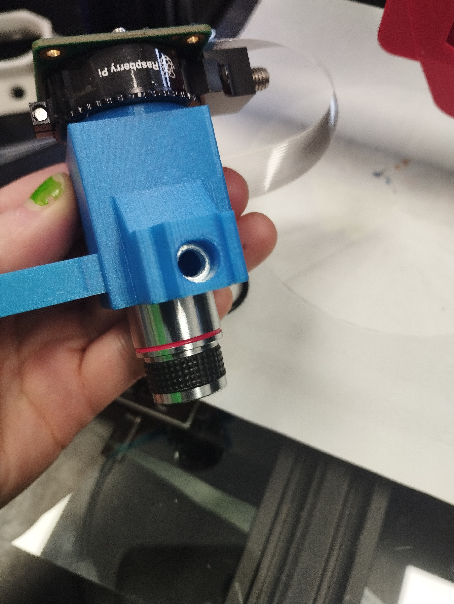
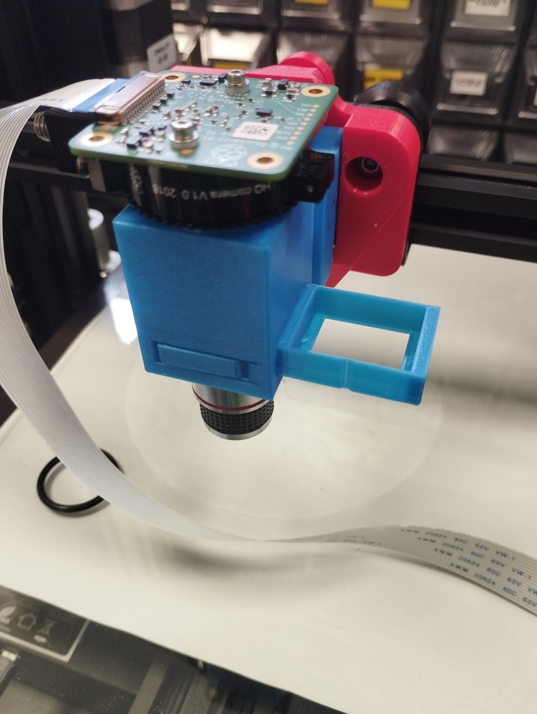
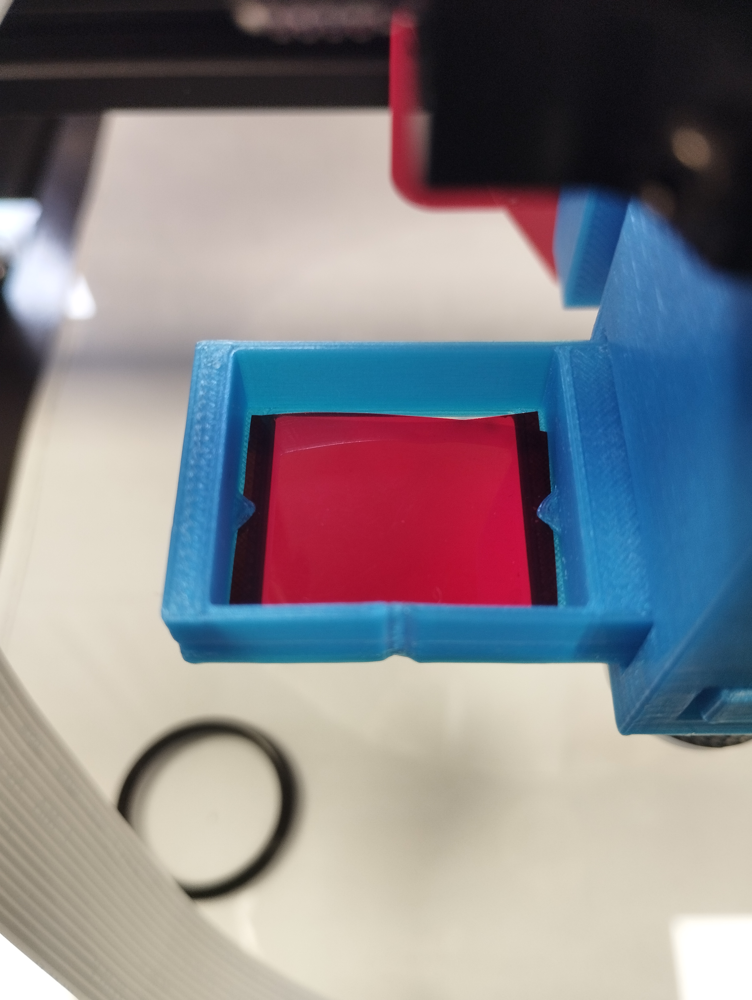
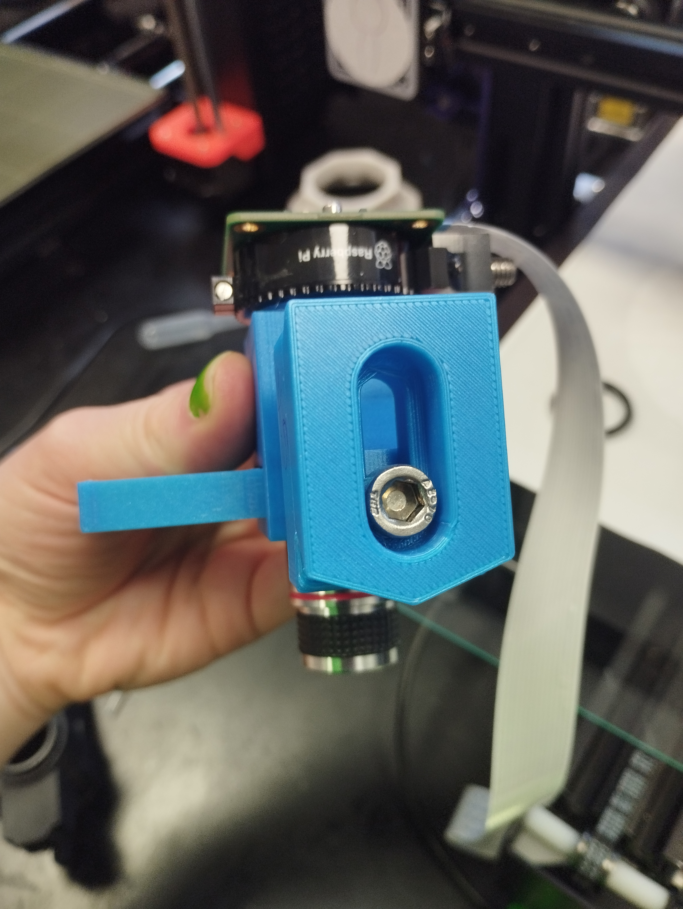
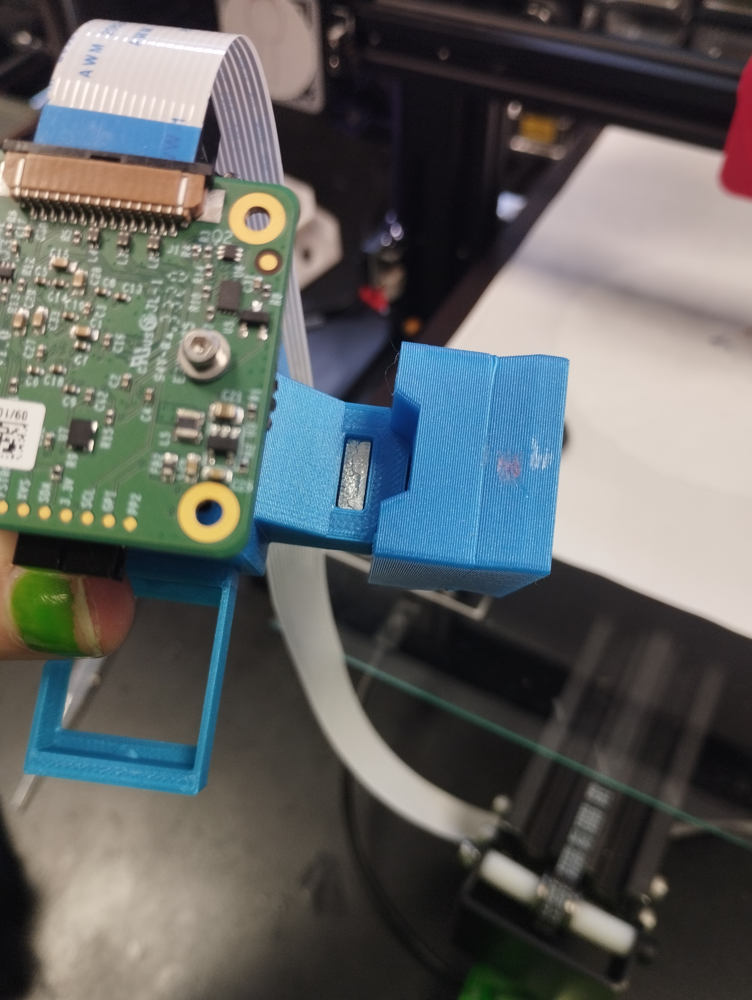

# EnderScope
The EnderScope is a low-cost scanning microscope, based on the mechanics of the ubiquitous 3D printer, the **Ender 3 Pro**. The hotend of the printer is replaced with an optics module, allowing for the reliable and well calibrated motion system of the 3D printer to be used for automated scanning over a large area.

# Help us get the EnderScope into the hands of the people! 
We are currently raising funds to distribute the EnderScope to Maker Spaces, Libraries and Community Environmental Groups around Ireland. Take a look at [our crowdfunder on Experiment.com](https://www.experiment.com/enderscope) to learn more!

# How to Build Your Own EnderScope!
## Hardware
### Bill of Materials
| Part | Qty | Purpose | Source | Price € |
| ----------- | ----------- | ----------- | ----------- | ----------- |
| **Non-printed Parts** |
| Ender 3 Pro | 1 | Motion system of EnderScope | [Link to Ender](https://ie.farnell.com/creality-3d/ender-3-pro/3d-printer-220-x-220-x-250mm-1/dp/2945489) | 224.65 |
| Keyboard & Mouse | 1 | Control of EnderScope | [Link to keyboard and mouse](https://www.amazon.co.uk/Richer-R-Keyboard-Portable-Lightweight-Ultra-Thin-Black/dp/B07CRM63WW/ref=sr_1_5?crid=23O5WNS7BQETO&keywords=usb+keyboard+and+mouse+small&qid=1687527843&sprefix=usb+keyboard+and+mousesmall%2Caps%2C48&sr=8-5) | 15.48 |
| Monitor | 1 | Display for EnderScope | [Link to Monitor](https://www.amazon.co.uk/Dell-Professional-Widescreen-Backlit-Monitor/dp/B00F6390EI/ref=sr_1_5?crid=155O3H11AT8RS&keywords=flat+panel+monitor&qid=1687528400&sprefix=flat+panel+monitor%2Caps%2C56&sr=8-5) | 58.16 |
| HDMI-micro HDMI | 1 | To connect Raspberry Pi to Monitor | [Link to HDMI-microHDMI](https://ie.farnell.com/raspberry-pi/t7733ax/cable-micro-hdmi-hdmi-plug-2m/dp/3107129?gclid=CjwKCAjwhdWkBhBZEiwA1ibLmHy8lcH_6-mT7bqlnekisB4aghKRtLZO5OpQ6GcXcyXmCx-YCe7CPRoCSIsQAvD_BwE&gross_price=true&CMP=KNC-GIE-GEN-SHOPPING-PerformanceMax-TEST-962) | 5.62 |
| 4x RMS Finite Conjugate Objective Lens | 1 |  | [Link to objective lens](https://www.amazon.com/Compound-Microscope-Achromatic-Objectives-Conjugate/dp/B08HW6XMQQ/ref=sr_1_2?crid=2XI5O2ZMWLERR&keywords=rms+finite+conjugate+objective+lens&qid=1674738740&sprefix=rms+finite+conjugate+objective+lens%2Caps%2C127&sr=8-2) | 8.63 |
| Raspberry Pi HQ Camera | 1 | | [Link to HQ Camera](https://ie.farnell.com/raspberry-pi/rpi-hq-camera/rpi-high-quality-camera-12-3-mp/dp/3381605?gclid=CjwKCAjwhdWkBhBZEiwA1ibLmLPRsZ-kTz68qI1Buou0t5rqj3jjkPpFDO3mcRCRjVkKVoDt2jtdiRoC4SUQAvD_BwE&gross_price=true&CMP=KNC-GIE-GEN-SHOPPING-PerformanceMax-No-Impressions) | 56.54 |
| Raspberry Pi 4 Model B | 1 | A low-cost computer used to run the EnderScope | [Link to Raspberry Pi](https://ie.farnell.com/raspberry-pi/rpi4-modbp-4gb/raspberry-pi-4-model-b-4gb/dp/3051887) | 62.20 |
| Pi camera CSI cable (Long ~100cm) | 1 | Connect Raspberry Pi to HQ Camera | [Link to CSI Cable](https://ie.farnell.com/mcm/83-17610/csi-dsi-extension-cable-1-meter/dp/2801336?st=100cm%20csi%20cable) | 6.32 |
| 5V Power Supply USB Type C | 2 | To power Raspberry Pi | [Link to Raspberry Pi power supply](https://ie.rs-online.com/web/p/raspberry-pi-power-supplies/1873424?cm_mmc=IE-PLA-DS3A-_-google-_-CSS_IE_EN_Pmax_Test-_--_-&matchtype=&&s_kwcid=AL!14853!3!!!!x!!&gclid=Cj0KCQjw7uSkBhDGARIsAMCZNJvJgLZ8F8H9JMSdhJQLBEwR4ra1u99iysdaG6aJ2BMPwZ8ZWJeXU8waAowZEALw_wcB&gclsrc=aw.ds) | 9.69 |
| 5V Power Supply USB | 2 | To power Arduino Nano| [Link to 5V power supply](https://www.amazon.co.uk/Charger-Adaptor-Compact-Charging-Samsung/dp/B0BV65Y6B2/ref=sr_1_9?crid=2RVFZQS96QDYE&keywords=5v+wall+charger&qid=1687785970&sprefix=5v+wall+%2Caps%2C58&sr=8-9) | 5.98 |
| Arduino Nano | 1 | To control LED ring | [Link to Arduino](https://store.arduino.cc/products/arduino-nano?queryID=undefined) | 21.60 |
| Push Button | 1 | Turn LED ring on, green or white | [Link to push buttons](https://www.amazon.co.uk/Gikfun-6x6x5mm-Switch-Arduino-EK1019U/dp/B07DQL2GG4/ref=sr_1_1_sspa?crid=17EAN9SJTHE6H&keywords=arduino+push+button&qid=1687538997&sprefix=arduino+push+button%2Caps%2C59&sr=8-1-spons&sp_csd=d2lkZ2V0TmFtZT1zcF9hdGY&psc=1) | 8.09 |
| 220 Ohm Resistor | 1 | For push button | [Link to resistors](https://www.amazon.co.uk/Projects-50EP114220R-220-Resistors-Pack/dp/B0BQ1W9RHK/ref=sr_1_4_sspa?crid=3U55YJR7HT7W&keywords=220+ohm+resistor&qid=1687539054&sprefix=220%2Caps%2C58&sr=8-4-spons&sp_csd=d2lkZ2V0TmFtZT1zcF9hdGY&psc=1) | 6.08 |
| 170 pin breadboard | 1 | For arduino and push button | [Link to breadboard](https://www.amazon.co.uk/SIGNAL-PSG-BB-170W-2BP-Breadboard-Plastic-34-5mm/dp/B01IO3IS12/ref=sr_1_3?crid=2BN9MA6U1KGBD&keywords=170+pin+breadboard&qid=1687539158&sprefix=170+pin+breadboard%2Caps%2C46&sr=8-3) | 3.85 |
| Male to Male Jumper Wires | 7 | For wiring of LED ring and push button | [Link to jumper wires](https://www.amazon.co.uk/2-54mm-Jumper-Wires-Cables-female/dp/B09T3QF6VP/ref=sr_1_48?adgrpid=63845174572&hvadid=291338039024&hvdev=c&hvlocphy=1007850&hvnetw=g&hvqmt=e&hvrand=17576542995084926756&hvtargid=kwd-300565221968&hydadcr=18912_1787284&keywords=male%2Bto%2Bmale%2Bjumper%2Bwires&qid=1687783718&sr=8-48&th=1) | 1.99 |
| USB type A - mini B Cable | 1 | To connect Arduino Nano to 5V power supply | [Link to USB mini cable](https://www.amazon.co.uk/LINDY-36722-Mini-B-Cable-Anthra/dp/B07FN1W4JL/ref=sr_1_3?keywords=mini%2Busb%2Bcable&qid=1687784057&sr=8-3&th=1) | 3.05 |
| USB type A - Micro USB Cable | 1 | To connect Ender to Raspberry Pi| [Link to micro USB cable](https://www.amazon.co.uk/AmazonBasics-Male-Micro-Cable-Black/dp/B07232M876/ref=sr_1_1_ffob_sspa?crid=276BWYDT9STTD&keywords=micro%2Busb%2Bcable&qid=1687784254&s=computers&sprefix=micro%2Busb%2B%2Ccomputers%2C55&sr=1-1-spons&sp_csd=d2lkZ2V0TmFtZT1zcF9hdGY&th=1) | 5.07 |
| Lighting Gels | 1 | Used as Emmission Filter | [Link to lighting gels](https://www.aliexpress.com/item/32695436168.html?pdp_npi=2%40dis%21EUR%21%E2%82%AC%208%2C78%21%E2%82%AC%208%2C78%21%21%21%21%21%4021032fa616703165944567885e866e%2165363130207%21btf&_t=pvid:451ae040-dcc0-4a03-897e-5453e0968200&afTraceInfo=32695436168__pc__pcBridgePPC__xxxxxx__1670316594&spm=a2g0o.ppclist.product.mainProduct) | 7.66 |
| 16 LED Ring | 1 | Illumination Source for Microscope | [Link to LED ring](https://www.amazon.co.uk/Hobby-Components-Ltd-45MM-WS2812B/dp/B01I1D6O48/ref=sr_1_4?keywords=neopixel+16+led+ring&qid=1687539564&sr=8-4) | 9.53 |
| Glass from picture frame, 2mm in thickness, 21x30cm | 1 | Used as a "coverslip" | [Link to picture frame](https://www.ikea.com/ie/en/p/yllevad-frame-black-30429774/?utm_source=google&utm_medium=surfaces&utm_campaign=shopping_feed&utm_content=free_google_shopping_clicks_Decoration&gclid=Cj0KCQjw7uSkBhDGARIsAMCZNJuPV9QcnTO9ueFVAxaAVzIDQurpOPyJlUqf1WcASSWj0xErUw77xK0aAkzMEALw_wcB&gclsrc=aw.ds) | 2.00 |
| Binder Clips | 4 | To hold glass on print bed | [Link to binder clips](https://www.amazon.co.uk/Office-Files-Documents-Metal-Binder/dp/B00W0K3ENS/ref=sr_1_7?keywords=binder+clips&qid=1687796157&sr=8-7) | 2.38 |
| **Screws, Nuts and Tools** |
| M6 12mm Screw | 1 |  |  |  |
| M6 Square Nut | 1 |  |  |  |
| Alan Keys | 1 |  |  |  |
| M3 Screws and Nuts | 4 screws, 4 nuts |  |  |  |
| Scissors | 1 |  |  |  |
| **Total** |  |  |  |  |

### Printed Parts
All 3D-printable files can be found [here](Stls). All files were printed in PLA, with 0.2mm layer height, no supports needed.

## Software
All software for the EnderScope can be found [here](Software).

## Assembly Instructions
### Step 1: Quick Change Mechanism
> The quick change mechanism is designed to allow you to easily swap back and forth between the original hotend of the 3D printer and the microscope. This means you don't have to sacrifice your 3D printer to have a microscope, **you can have both!**
> 
> The quick change tool mechanism was adapted from the following design on thingiverse: https://www.thingiverse.com/thing:3369444/files. There are more details including a youtube video showing how to mount the base on to the X axis of the printer at the above link. 

- Print all printed parts. Best to do this before we start dismantling the hotend in particular make sure **'ToolHolderBase'**, **‘Lever’** and **‘EnderHotendToolHolder’** are printed before you dismantle the hotend of the printer as these are essential to allow the hotend to be reattached).

- Remove ender hotend. This will also involve disconnecting the nozzle thermistor, bed thermistor, two part cooling fans, hot end fan, heat bed.

- Attach the printed **‘ToolHolderBase’** to the x axis rollers with the screws and nuts supplied with the Ender. 

- Attach the printed **‘Lever’** with an M4 screw (16 or 20mm) and M4 washer. This is 
intended to be a tight fit and you may need to widen the hole with a drill. 

- Attach the Ender hotend to the printed **‘EnderHotendToolHolder’** using the screws supplied with the Ender. 

### Step 2: Lens Tube
- Print **‘LensTube’** if you haven’t already. Insert square M6 nut into the print.

### Step 3: Filter Slider
- Print **‘FilterSlider’** if you haven’t already. Cut out a small square from the lighting gel that is big enough to cover one of the holes in the **‘FilterSlider’** print and clip it in under the triangle notches in the print.

- Attach Raspberry Pi HQ Camera to C-mount threads on the **‘LensTube’**.

- Attach **‘EnderScopeToolHolder’** to the **‘LensTube’** by placing an M6 (12mm, cap head screw will work nicely) screw through the back of the tool changer and screwing this through to the square nut embedded in the **LensTube** print. The ridge of the **EnderScopeToolHolder** should line up with the ridge on the **LensTube**.

- The entire **'EnderScopeToolHolder'** and lens tube assembly can now be mounted on the **'ToolHolderBase'** on the x axis of the printer.

- Screw a 4x finite conjugate RMS threaded objective lens into bottom of the **'LensTube'**. 

### Step 3: Limit Switch Extender
- If using the microscope module, first attach the **'LimitSwitchExtender'** onto the plastic covering of the x axis limit switch. This will trigger the z axis limit switch from a higher position so the objective lens will not crash into the bed during homing.

### Step 4: Illumination 
- Print **‘NeopixelClamp’**, **‘NeopixelMount’** and **‘NeopixelClamp_AmazonInsert’**.
- Place the **‘NeopixelClamp_AmazonInsert’** around the objective lens, then clamp the **‘NeopixelClamp’** around it.
- Attach two **‘NeopixelConnecter’** to the **‘NeopixelClamp’** with M3 screws and nuts.
- Attach the **‘NeopixelMount’** to the **‘NeopixelConnecter’** with M3 screws and nuts.
- Solder dupont cables to 5v, ground and data input solder pads of the Neopixel 16 LED ring.
- Wire up the neopixel as shown below:

- Remove the adhesive backing on the 170 pin breadboard and place this on the **'ArduinoNanoHolder'**. Slide the **'ArduinoNanoHolder'**, with the breadboard, push button and Arduino Nano attached, on to the Raspberry Pi Camera.
- Attach the **'CableTidy'** to the horizontal crosspiece on the Ender frame. Clip the USB cable and Raspberry Pi CSI cable into the **'CableTidy'**.
- Upload the relevant Arduino sketch to the Arduino nano.
  
### Step 5: EnderScope
- Connect the Raspberry Pi HQ Camera to the Raspberry Pi using the CSI cable.
- Connect Raspberry Pi to monitor with HDMI-micro HDMI cable.
- Turn Ender on.
- Power up Raspberry pi and ****then**** connect Ender to pi using the USB to microUSB cable. 

>**NB** It is really important to switch the Ender printer on **FIRST** before attaching it to the Raspberry Pi. Otherwise the Pi will try to power the Ender itself.

- Remove the build surface for the Ender and place the glass frame on the print bed.

- Clip in place with binder clips (be careful where you position the binder clips. Make sure they will not crash into the aluminium frame of the printer when it homes).

### Congratulations you are now ready to start using the EnderScope! :-)

# How to Use the EnderScope

# Licence and Collaboration

