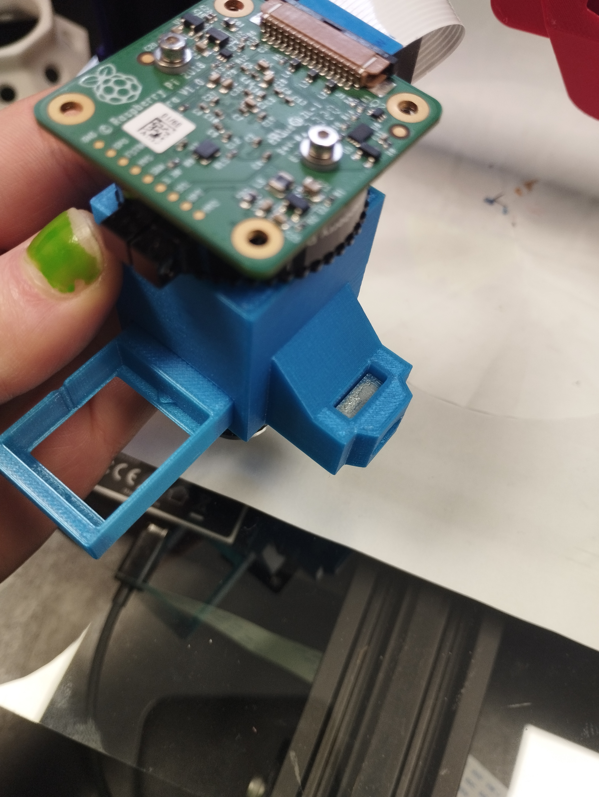

# EnderScope
The EnderScope is a low-cost scanning microscope, based on the mechanics of the ubiquitous 3D printer, the **Ender 3 Pro**. The hotend of the printer is replaced with an optics module, allowing for the reliable and well calibrated motion system of the 3D printer to be used for automated scanning over a large area.

## How to Build Your Own EnderScope!
## Hardware
### Bill of Materials
| Part | Qty | Purpose | Source | Price € |
| ----------- | ----------- | ----------- | ----------- | ----------- |
| **Non-printed Parts** |
| Ender 3 Pro | 1 | Motion system of microscope | [Link to Ender](https://ie.farnell.com/creality-3d/ender-3-pro/3d-printer-220-x-220-x-250mm-1/dp/2945489) | 224.65 |
| Keyboard & Mouse | 1 |  | [Link to keyboard and mouse](https://www.amazon.co.uk/Richer-R-Keyboard-Portable-Lightweight-Ultra-Thin-Black/dp/B07CRM63WW/ref=sr_1_5?crid=23O5WNS7BQETO&keywords=usb+keyboard+and+mouse+small&qid=1687527843&sprefix=usb+keyboard+and+mousesmall%2Caps%2C48&sr=8-5) | 15.48 |
| Monitor | 1 | Display for microscope | [Link to Monitor](https://www.amazon.co.uk/Dell-Professional-Widescreen-Backlit-Monitor/dp/B00F6390EI/ref=sr_1_5?crid=155O3H11AT8RS&keywords=flat+panel+monitor&qid=1687528400&sprefix=flat+panel+monitor%2Caps%2C56&sr=8-5) | 58.16 |
| HDMI-micro HDMI | 1 | To connect Raspberry Pi to Monitor | [Link to HDMI-microHDMI](https://ie.farnell.com/raspberry-pi/t7733ax/cable-micro-hdmi-hdmi-plug-2m/dp/3107129?gclid=CjwKCAjwhdWkBhBZEiwA1ibLmHy8lcH_6-mT7bqlnekisB4aghKRtLZO5OpQ6GcXcyXmCx-YCe7CPRoCSIsQAvD_BwE&gross_price=true&CMP=KNC-GIE-GEN-SHOPPING-PerformanceMax-TEST-962) | 5.62 |
| 4x RMS Finite Conjugate Objective Lens | 1 |  | [Link to objective lens](https://www.amazon.com/Compound-Microscope-Achromatic-Objectives-Conjugate/dp/B08HW6XMQQ/ref=sr_1_2?crid=2XI5O2ZMWLERR&keywords=rms+finite+conjugate+objective+lens&qid=1674738740&sprefix=rms+finite+conjugate+objective+lens%2Caps%2C127&sr=8-2) | 8.63 |
| Raspberry Pi HQ Camera | 1 |  | [Link to HQ Camera](https://ie.farnell.com/raspberry-pi/rpi-hq-camera/rpi-high-quality-camera-12-3-mp/dp/3381605?gclid=CjwKCAjwhdWkBhBZEiwA1ibLmLPRsZ-kTz68qI1Buou0t5rqj3jjkPpFDO3mcRCRjVkKVoDt2jtdiRoC4SUQAvD_BwE&gross_price=true&CMP=KNC-GIE-GEN-SHOPPING-PerformanceMax-No-Impressions) | 56.54 |
| Raspberry Pi 4 Model B | 1 |  | [Link to Raspberry Pi](https://ie.farnell.com/raspberry-pi/rpi4-modbp-4gb/raspberry-pi-4-model-b-4gb/dp/3051887) | 62.20 |
| Pi camera CSI cable (Long ~100cm) | 1 | Connect Raspberry Pi to HQ Camera | [Link to CSI Cable](https://ie.farnell.com/mcm/83-17610/csi-dsi-extension-cable-1-meter/dp/2801336?st=100cm%20csi%20cable) | 6.32 |
| 5V Power Supply | 2 | One to power Raspberry Pi and one to power Arduino Nano| Text | Text |
| Arduino Nano | 1 | Text | Text | Text |
| Push Button | 1 | Text | Text | Text |
| 220 Ohm Resistor | 1 | Text | Text | Text |
| 170 pin breadboard | 1 | Text | Text | Text |
| USB-Mini USB Cable | 1 | To connect Arduino Nano to 5V power supply | Text | Text |
| USB-Micro USB Cable | 1 | To connect Ender to Raspberry Pi| Text | Text |
| Lighting Gels | 1 | Used as Emmission Filter | Text | Text |
| 16 LED Ring | 1 | Illumination Source for Microscope | Text | Text |
| Glass from picture frame, 2mm in thickness, 21x30cm | 1 | Text | Text | Text |
| Binder Clips | 4 | To hold glass on print bed | Text | Text |
| **Screws, Nuts and Tools** |
| M6 12mm Screw | 1 | Text | Text | Text |
| M6 Square Nut | 1 | Text | Text | Text |
| Alan Keys | 1 | Text | Text | Text |
| M3 Screws and Nuts | 4 screws, 4 nuts | Text | Text | Text |
| Scissors | 1 | Text | Text | Text |

### Printed Parts
All 3D-printable files can be found [here](Stls). All files were printed in PLA, with 0.2mm layer height, no supports needed.

## Software
All software for the EnderScope can be found [here](Software).

## Assembly Instructions
### Step 1: Quick Change Mechanism
> The quick change mechanism is designed to allow you to easily swap back and forth between the original hotend of the 3D printer and the microscope.
> 
> The quick change tool mechanism was adapted from the following design on thingiverse: https://www.thingiverse.com/thing:3369444/files. There are more details including a youtube video showing how to mount the base on to the X axis of the printer at the above link. 

Print all printed parts. Best to do this before we start dismantling the hotend (in particular make sure **‘ToolHolderBase’**, **‘Lever’** and **‘EnderHotendToolHolder’** are printed before you dismantle the hotend of the printer as these are essential to allow the hotend to be reattached).

Remove ender hotend. This will also involve disconnecting the nozzle thermistor, bed thermistor, two part cooling fans, hot end fan, heat bed.

Attach the printed **‘ToolHolderBase’** to the x axis rollers with the screws and nuts supplied with the Ender. 

Attach the printed **‘Lever’** with an M4 screw (16 or 20mm) and M4 washer. This is 
intended to be a tight fit and you may need to widen the hole with a drill. 

Attach the Ender hotend to the printed **‘ToolHolder’** using the screws supplied with the Ender. 

### Step 2: Lens Tube
Print **‘Lens Tube’** if you haven’t already. Insert square M6 nut into the print.

### Step 3: Filter Slider
Print **‘FilterSlider’** if you haven’t already. Cut out a small square from the photographic gel that is big enough to cover one of the holes in the **‘FilterSlider’** print and clip it in under the triangle notches in the print.

Attach Raspberry Pi HQ Camera to C-mount threads on the **‘Lens Tube’**.

Attach **‘EnderScopeToolChanger’** to the **‘Lens Tube’** by placing an M6 (12mm, cap head screw will work nicely) screw through the back of the tool changer (with head of screw sitting into hole) and screwing this through to the square nut embedded in the **Lens Tube** print. The ridge of the **EnderScopeToolChanger** should line up with the ridge on the **Lens tube**.

The entire EnderScopeToolChanger and lens tube assembly can now be mounted on the ToolHolderBase on the x axis of the printer.

Screw a 4x finite conjugate RMS threaded objective lens into bottom of lens tube. We use this cheap one from amazon: 

### Step 3: Limit Switch Extender
If using the microscope module, first attach the limit switch extender onto the plastic covering of the x axis limit switch. This will trigger the z axis limit switch from a higher position so the objective lens will not crash into the bed during homing.

### Step 4: Illumination 
Print **‘Adjustable Neopixel Clamp v1.stl’**, **‘Neopixel mount v1.stl’** and **‘Adjustable illumination clamp 2.3 Amazon insert v3.stl’**.
Place the **‘Amazon insert’** around the objective lens, then clamp the **‘Neopixel clamp’** around it.
Attach two **‘Adjustable Arms’** to the **‘Neopixel clamp’** with M3 screws and nuts.
Attach the **‘Neopixel mount’** to the **‘Adjustable Arms’** with M3 screws and nuts.
Solder dupont cables to 5v, ground and data input solder pads. 
Wire up the neopixel as shown below:
Upload the following sketch to the Arduino Nano:

### Step 5: EnderScope
Connect pi camera to raspberry pi
Connect raspberry pi to monitor
Turn Ender on.
Power up Raspberry pi and then connect Ender to pi using the USB to microUSB cable. 

>**NB** It is really important to switch the Ender printer on **FIRST** before attaching it to the Raspberry Pi. Otherwise the Pi will try to power the Ender itself.

Remove the build surface for the ender and place the glass frame on the print bed.

Clip in place with binder clips (be careful where you position the binder clips. Make sure they will not crash into the printer when it homes).

## How to Use the EnderScope
